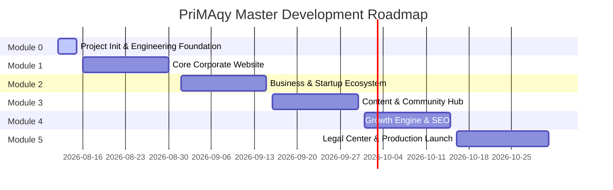

# Product & Venture Roadmap — PriMAqy

---

## Strategic Phases

---

## Phase Details

### Phase 1: Module 0 — Foundation (Current)
- Establish codebase, Next.js 16+ App Router, TypeScript, Tailwind CSS, Lucide React.
- Complete 37 master architectural and product documents.
- Configure legal guardrails (`src/data/company.ts`) and environment rules.

### Phase 2: Module 1 — Core Portal
- Deploy `/`, `/about`, `/products`, `/products/toolsetic`, `/technology`, `/team`.
- Establish responsive component design system and header/footer layouts.

### Phase 3: Module 2 — Business Ecosystem
- Launch `/startup`, `/startup/documents`, `/investors`, `/careers`, `/media`.
- Publish versioned public product briefs and brand asset repository.

### Phase 4: Module 3 — Content & Community
- Launch `/insights`, `/insights/[slug]`, `/community`, `/newsletter`.
- Integrate markdown publication pipeline and newsletter capture abstraction.

### Phase 5: Module 4 — Growth Engine
- Enable site-wide SEO metadata, dynamic `sitemap.xml`, `robots.txt`, JSON-LD.
- Connect modular event tracking in `lib/analytics.ts`.

### Phase 6: Module 5 — Production Launch
- Finalize Privacy Policy, Terms of Service, Cookie Policy, Legal Center.
- Run security audit, zero-lint check, production build, and Vercel launch.
