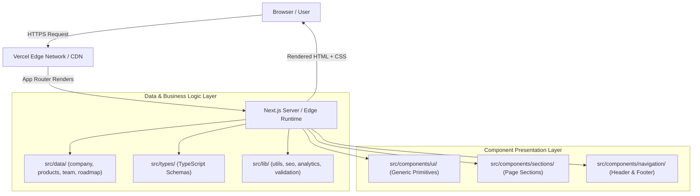

# System Architecture — PriMAqy Platform

---

## 1. High-Level Architecture Overview

The PriMAqy web platform is architected as a static-first, server-rendered web application built on **Next.js 16+ App Router**, **TypeScript**, and **Tailwind CSS v4**. It decouples static data storage from component presentation and delegates page routing entirely to the Next.js App Router filesystem conventions.

---

## 2. Fundamental Architectural Principles

1. **Server-First Component Default**: Every component in `src/app/` and `src/components/` is a Server Component unless interactive features (e.g. state, effects, event handlers) mandate the `"use client"` directive.
2. **Data Layer Decoupling**: Static content, company metadata, product parameters, and team details are never hardcoded inside JSX. They are imported from typed modules in `src/data/`.
3. **Legal Compliance Isolation**: Corporate status fields (`entityStatus`, `dpiitStatus`, `trademarkStatus`, etc.) are centralized in `src/data/company.ts` with strict defaults preventing unverified claims.
4. **Thin Route Handler Pattern**: Route entrypoints (`src/app/**/page.tsx`) maintain minimal logic, serving primarily to compose section components and pass typed data.
5. **Zero External API Lock-in**: Analytics, SEO, and email services are abstracted behind wrapper modules in `src/lib/` to allow zero-downtime provider swaps in future modules.
