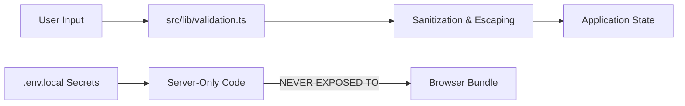

# Security Architecture & Risk Control — PriMAqy

---

## 1. Security Architecture Principles

1. **Environment Secret Protection**: No API keys, credentials, or private tokens are permitted in code repositories. `.env` and `.env.local` are strictly git-ignored.
2. **Public Variable Scoping**: Only variables explicitly intended for browser execution are prefixed with `NEXT_PUBLIC_`.
3. **Legal Misrepresentation Prevention**: Corporate legal claims are validated through `src/data/company.ts` guardrails to prevent unauthorized claims.
4. **Input Validation**: Form inputs (contact, newsletter) are sanitized and validated using schema definitions in `src/lib/validation.ts`.
5. **Security HTTP Headers**: Production Vercel response headers enforce X-Content-Type-Options, Referrer-Policy, and X-Frame-Options.

---

## 2. Security Layer Diagram

